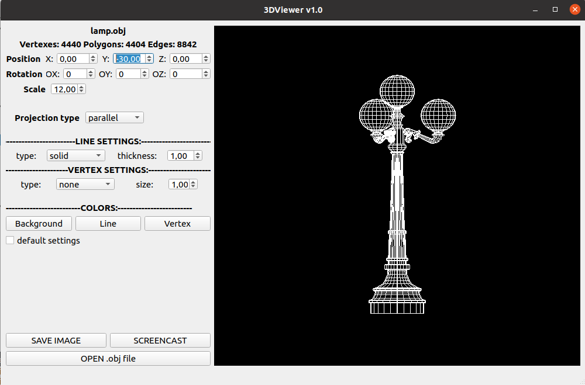
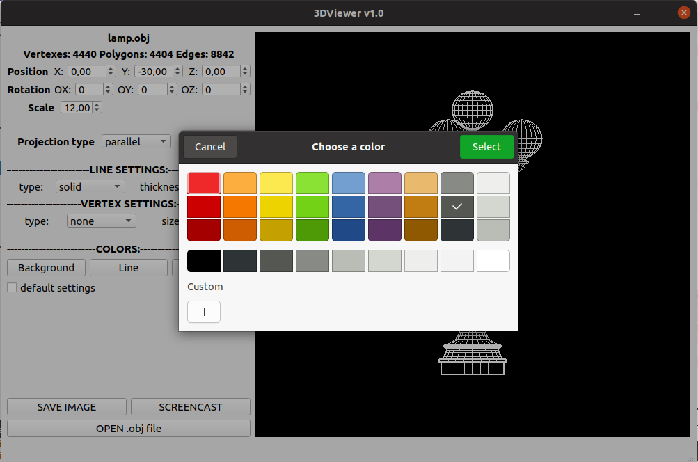
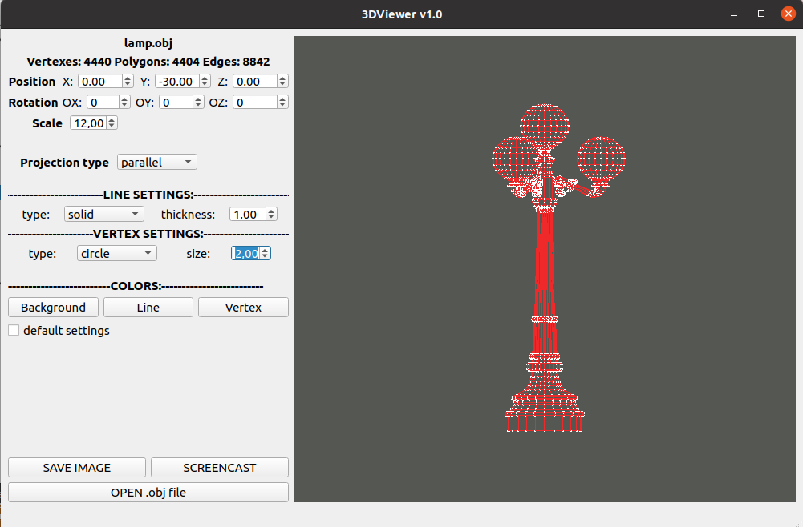
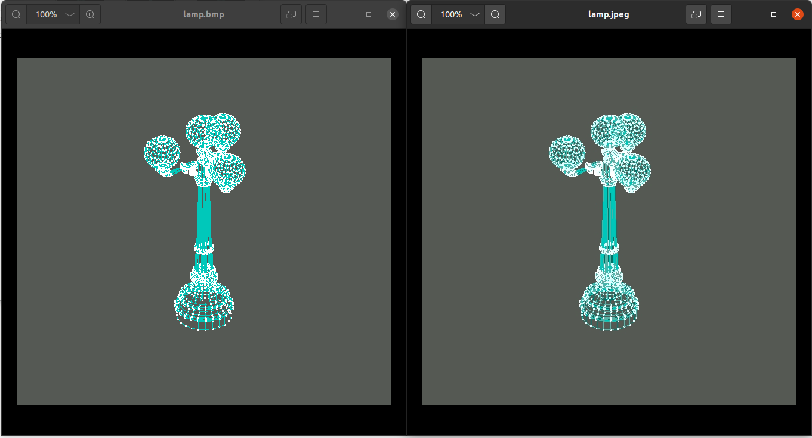

# 3DViewer

Реализация программы для просмотра 3D моделей в каркасном виде (3D Viewer). Сами модели необходимо загружать из файлов формата .obj.  
Есть возможность:
- вращения, масштабирования и перемещения объекта;
- выбора настроек отображения:
  - тип, толщина и цвет линий;
  - тип, размер и цвет вершин;
  - тип проекции;
  - цвет фона;
- автоматического сохранения настроек;
- сохранения полученных изображений в файлы форматов bmp и jpeg;
- записи аффинных преобразований загруженного объекта в gif-анимацию (640x480, 10fps, 5s).

Сохранение полученных изображений в файлы форматов bmp и jpeg:  

Запись аффинных преобразований объекта в gif-анимацию:  

